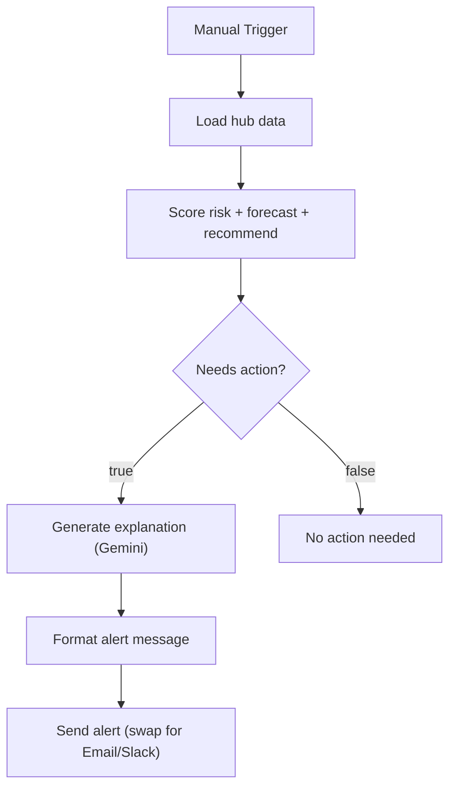

# KSKT wastage-risk alert workflow (prototype)

A small end-to-end demo of the workflow described in my message: cross-reference
spoilage risk against demand forecast, per SKU per hub, and turn that into a
specific action an ops person can execute — not just a number to interpret.

## Why this shape

KSKT already reports 3% wastage and 68% repeat usage at scale — the risk isn't
that stock spoils, it's that stock spoils *unevenly*: some SKU at some hub is
overstocked relative to how fast it's actually moving, while shelf life is
running out. A generic demand-forecasting model doesn't catch that on its own —
it has to be cross-referenced against what's currently sitting in inventory
and how close it is to going bad.

## Pipeline

```
data.js               synthetic hub inventory + 7-day sales history
  → spoilageRisk.js    shelf-life-remaining vs stock age → risk level
  → demandForecast.js  weighted moving average + trend direction
  → recommendationEngine.js   combines both into one action + urgency
  → llmExplainer.js    turns the structured decision into a one-line,
                        specific instruction for the ops team
→ index.js             runs it all, prints alerts to console
```

## n8n workflow (visual)

This is the same pipeline as an importable n8n workflow
(`kskt-wastage-workflow.n8n.json`) — trigger, load data, score, then branch
on whether the item actually needs action:



Import the JSON into n8n via *Import from File* to run it directly — no
code editing required, only the same `GEMINI_API_KEY` env var mentioned
above.

## Run it

```
node index.js
```

No dependencies, no API key required — the LLM layer falls back to a
templated explanation if `GEMINI_API_KEY` isn't set, so the pipeline is
fully inspectable without secrets. Set the env var to see it call a live
Gemini model instead. (The n8n version of this workflow reads the same
env var, `GEMINI_API_KEY`, inside the "Generate explanation" node.)

## What's real vs. illustrative

- The logic (risk scoring, forecasting, decision rules, output format) is
  real and runnable — not pseudocode.
- The data in `data.js` is synthetic — I don't have access to KSKT's actual
  inventory or sales feed. Swapping `data.js` for a real query against your
  warehouse/POS system is the only change needed to point this at live data.
- The decision thresholds (0.5, 0.75 life-used fractions; 30%/40% surplus
  ratios) are placeholders meant to be tuned against your actual wastage
  patterns, not final numbers.
